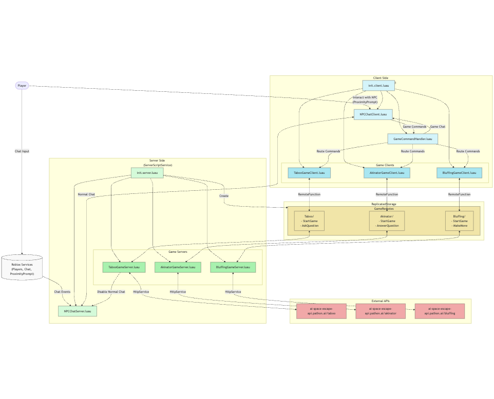

# System Design - AI Space Escape Games

## Project Overview
A Roblox game featuring multiple AI-powered games (Taboo, Akinator, and Bluffing) with NPC interaction. The project uses Rojo for file management and version control.

## System Architecture Diagram



## Directory Structure

### Server-Side (`src/server/`)

ServerScriptService/
└── Server/
    ├── init.server.luau           # Main server initialization
    ├── NPCChatServer.luau         # NPC chat handling and game command routing
    ├── TabooGameServer.luau       # Taboo game server logic
    ├── AkinatorGameServer.luau    # Akinator game server logic
    └── BluffingGameServer.luau    # Bluffing game server logic
```

### Client-Side (`src/client/`)
```
StarterPlayerScripts/
└── Client/
    ├── init.client.luau          # Main client initialization
    ├── NPCChatClient.luau        # NPC chat UI and interaction
    ├── GameCommandHandler.luau    # Central game command processing
    ├── TabooGameClient.luau      # Taboo game client logic
    ├── AkinatorGameClient.luau   # Akinator game client logic
    └── BluffingGameClient.luau   # Bluffing game client logic
```

### Shared Resources (`ReplicatedStorage/`)
```
ReplicatedStorage/
└── GameRemotes/
    ├── Taboo/
    │   ├── StartGame
    │   └── AskQuestion
    ├── Akinator/
    │   ├── StartGame
    │   └── AnswerQuestion
    └── Bluffing/
        ├── StartGame
        └── MakeMove
```

## Component Descriptions

### Server Components

1. **init.server.luau**
   - Creates RemoteFunction structure in ReplicatedStorage
   - Initializes all game servers
   - Sets up communication channels

2. **NPCChatServer.luau**
   - Handles NPC chat interactions
   - Routes game commands to appropriate servers
   - Manages chat events and proximity prompts
   - Special handling for Taboo game (disables normal chat)
   - Maintains normal chat for Akinator and Bluffing games

3. **Game Servers**
   - Handle game-specific logic
   - Communicate with external APIs
   - Manage game states per player
   - Process player inputs
   - Return game responses

### Client Components

1. **init.client.luau**
   - Initializes all client modules
   - Sets up necessary services
   - Manages client-side loading sequence

2. **NPCChatClient.luau**
   - Manages chat UI and display
   - Handles NPC proximity detection
   - Processes player interactions
   - Displays game messages

3. **GameCommandHandler.luau**
   - Processes game commands
   - Manages active game state
   - Routes commands to appropriate games
   - Handles game transitions

4. **Game Clients**
   - Handle game-specific UI
   - Manage local game state
   - Communicate with server via RemoteFunctions
   - Process player input

## Communication Flows

### Game Command Flow
```
Player Input → NPCChatClient → GameCommandHandler → Game Client → RemoteFunction → Game Server → API
```

### Chat Flow
```
Normal Chat: Player → NPCChatServer → NPCChatClient
Game Chat:   Player → GameCommandHandler → Game Client → Game Server → NPCChatClient
```

## Game States

### Taboo Game
- Disables normal chat when active
- Direct question/answer interaction
- API-based word guessing

### Akinator Game
- Maintains normal chat functionality
- Yes/No question format
- API-based character guessing

### Bluffing Game
- Maintains normal chat functionality
- Statement analysis
- API-based truth detection

## External Dependencies

### API Endpoints
- Taboo: `ai-space-escape-api.pathon.ai/taboo`
- Akinator: `ai-space-escape-api.pathon.ai/akinator`
- Bluffing: `ai-space-escape-api.pathon.ai/bluffing`

## Key Features

### 1. Modular Design
- Self-contained game modules
- Consistent interface patterns
- Easy addition of new games

### 2. State Management
- Centralized game state tracking
- Individual game state handling
- Clean game transitions

### 3. Error Handling
- Safe API communication
- Input validation
- State validation

### 4. User Experience
- Intuitive NPC interaction
- Clear game instructions
- Consistent feedback system

## Implementation Notes

### Server-Side
- Each game server maintains its own active games table
- NPCChatServer routes commands but doesn't manage game state
- RemoteFunctions created during initialization

### Client-Side
- GameCommandHandler manages active game state
- Game clients handle their own UI and state
- NPCChatClient handles general interaction

### Extensibility
- New games can be added by following the established pattern
- Each game requires client/server modules and RemoteFunctions
- NPCChatServer requires minimal updates for new games 